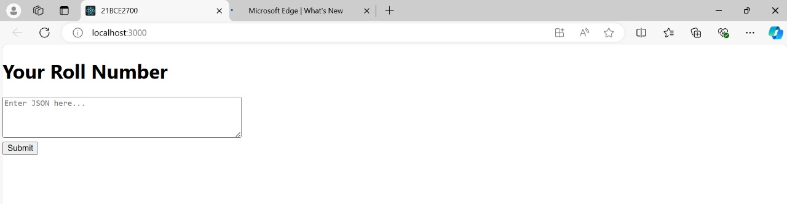
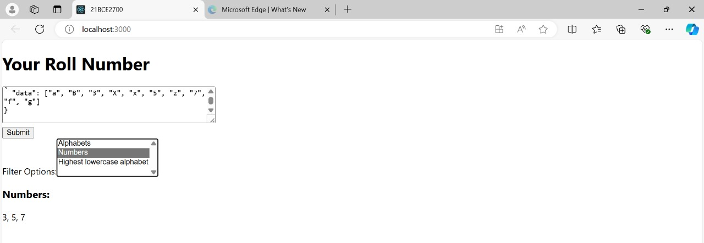

# My API Project

# Project Overview

## Description

This project consists of a Node.js REST API and a React frontend application. The backend API provides endpoints to process data, while the frontend allows users to interact with the API through a form interface.

## Features

### Node.js REST API

- **GET /bfhl**
  - Returns a simple JSON object with an `operation_code`.
- **POST /bfhl**
  - Processes an array of data sent in the request body.
  - Validates the data, separating it into numbers and alphabets.
  - Determines the highest lowercase alphabet.
  - Returns a JSON object with user details, numbers, alphabets, and the highest lowercase alphabet.

### React Frontend

- Provides a form to submit JSON data to the API.
- Allows users to specify what data to display from the API response via a multi-select dropdown.
- Displays the API response based on the user's selection, showing either alphabets, numbers, or the highest lowercase alphabet.

## API Details

- **Base URL:** `http://localhost:3000`
- **Endpoints:**
  - `GET /bfhl`: Returns `{ "operation_code": 1 }`
  - `POST /bfhl`: Processes input data and returns user details and processed data

## Frontend Interaction

- **Form Input:** Users can enter JSON data in a textarea.
- **Submit Button:** Sends the JSON data to the `/bfhl` endpoint.
- **Dropdown Menu:** Allows users to choose which parts of the API response they want to view.
- **Response Display:** Shows the results based on the selected options from the dropdown.

## Technology Stack

- **Backend:** Node.js with Express
- **Frontend:** React with Axios for API requests


## Example

## Example

Here is the Frontend 

Here is an example of the API response:


## Installation & Setup

1. **Clone the Repository:**
   ```bash
   git clone https://github.com/your-username/your-repo.git
   cd your-repo


## Getting Started

To run this API locally, follow these steps:

### Prerequisites

- [Node.js](https://nodejs.org/) (version 14 or higher)
- [npm](https://www.npmjs.com/) (comes with Node.js)

### Installation

1. **Clone the repository:**

   ```bash
   git clone https://github.com/Sanjana-06/BackendTest.git
   cd your-repo
   ```
2. **Install dependencies:**

    ```bash
    npm install
    ```
3. **Run the application:**

    ```bash
    npm start
    ```
## Usage

To test the API, you can use the following example JSON data:

```json
{
  "data": ["a", "B", "c", "3", "5", "z", "8", "g"]
}
```
